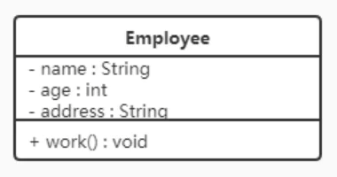
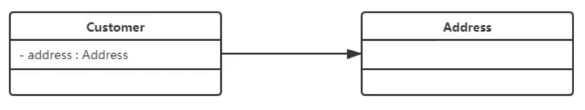
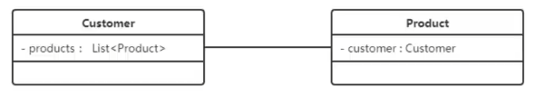
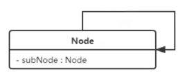
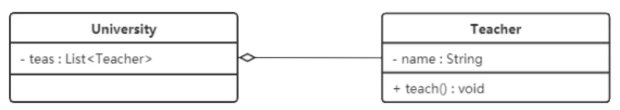
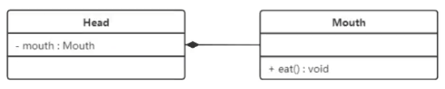
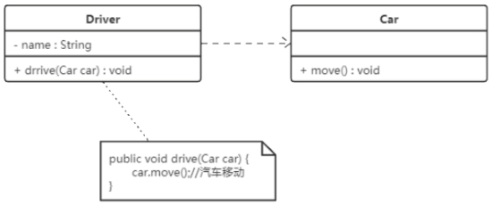
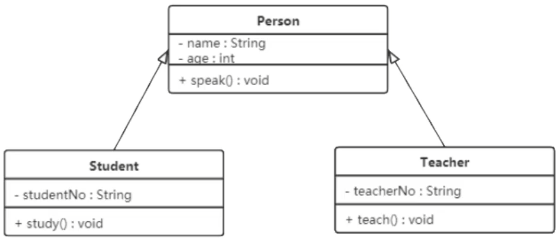
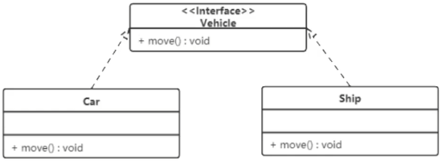

### Design Pattern

#### Overview

- 创建者模式: 用于描述"如何创建对象", 它的主要特点是"将对象的创建与使用分离"
- 结构型模式: 用于描述如何将类或对象按某种布局组成更大的结构
- 行为型模式: 用于描述类或对象之间如何相互协作共同完成单个对象无法单独完成的任务, 以及怎样分配职责

#### UML 图

> 类图

- 使用包含 `类名`, `属性` 和 `方法` 且带有分割线的矩形表示
- 属性/方法名称前使用符号表示其可见性
    - `+`: `public`
    - `-`: `private`
    - `#`: `protected`
- 属性的完整表示方式: `可见性 名称 : 类型 [ = 缺省值]`
- 方法的完整表示方式: `可见性 名称(参数列表) [ : 缺省值]`

> 类与类之间关系

- 关联关系: 对象之间的一种引用关系, 用于表示一类对象与另一类对象之间的联系
    - 单向关联  
      
    - 双向关联  
      
    - 自关联  
      
- 聚合关系: 是关联关系的一种, 是强关联关系, 是整体和部分的关系(部分可以脱离整体而存在)  
  
- 组合关系: 表示整体与部分的关系, 但它是一种更强烈的聚合关系(部分不能脱离整体而存在)  
  
- 依赖关系: 是一种使用关系, 它是对象之间耦合度最弱的一种关联方式, 是临时性的关联  
  
- 继承关系: 是对象之间耦合度最大的一种关系, 表示一般与特殊的关系, 是父类与子类之间的关系
  
- 实现关系: 是接口与实现类之间的关系, 类实现了接口, 类中的操作实现了接口中所声明的所有抽象操作  
  
